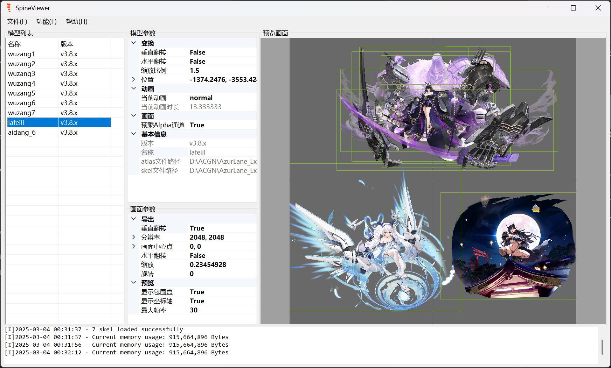

# SpineViewer

[中文](README.md) | [English](README.en.md)

一个简单好用的 Spine 文件查看&导出程序.

---

## 安装

前往 [Release](https://github.com/ww-rm/SpineViewer/releases) 界面下载压缩包.

`SelfContained` 可独立运行, `FrameworkDependent` 需要安装依赖框架 [.NET 桌面运行时 8.0.x](https://dotnet.microsoft.com/zh-cn/download/dotnet/8.0).

## 功能

- 支持不同版本 Spine 查看
    - [x] `v3.6.x`
    - [ ] `v3.7.x`
    - [x] `v3.8.x`
    - [ ] `v3.9.x`
    - [ ] `v4.0.x`
    - [ ] `v4.1.x`
    - [ ] `v4.2.x`
- 支持多骨骼文件动画预览
- 支持每个骨骼独立参数设置
- 支持动画PNG帧序列导出
- 支持缩放旋转等导出画面设置
- Coming soon...

## 使用方法

### 骨骼导入

**文件**菜单可以选择**打开**或者**批量打开**进行骨骼文件导入.

### 骨骼调整

在**模型列表**中选择一项或多项, 将会在**模型参数**面板显示可供调节的参数.

**模型列表**右键菜单可以对列表项进行增删调整, 也可以使用鼠标左键拖动调整顺序.

### 画面调整

**预览画面**支持的鼠标操作:

- 左键可以对骨骼进行拖动
- 右键对画面进行拖动
- 滚轮进行画面缩放

除此之外, 也可以通过**画面参数**面板调节导出和预览时的画面参数.

在**功能**菜单中, 可以重置同步所有骨骼动画时间.

### 动画导出

**文件**菜单中选择**导出**可以将目前加载的所有骨骼动画按照预览时的画面进行PNG帧序列导出.

可以在每个骨骼的**模型参数**中查看动画完整时长.

---

*如果你觉得这个项目不错请给个 :star:, 并分享给更多人知道! :)*
